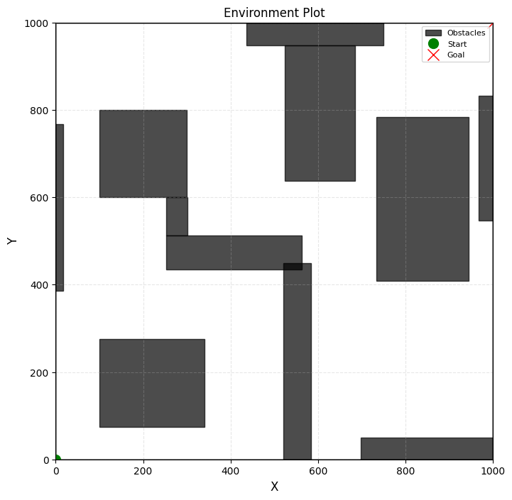
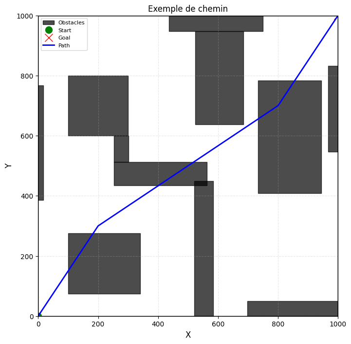
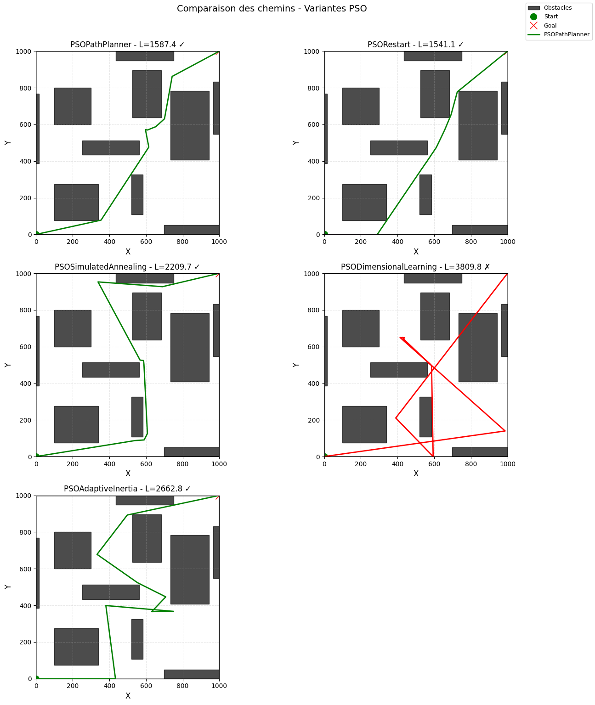
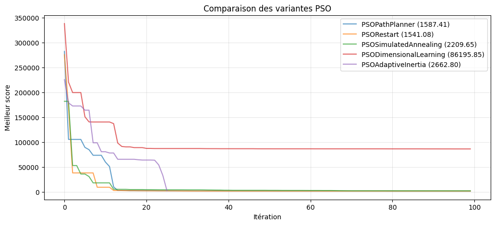
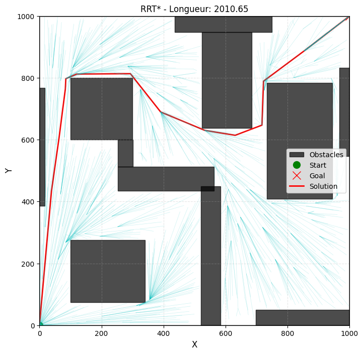
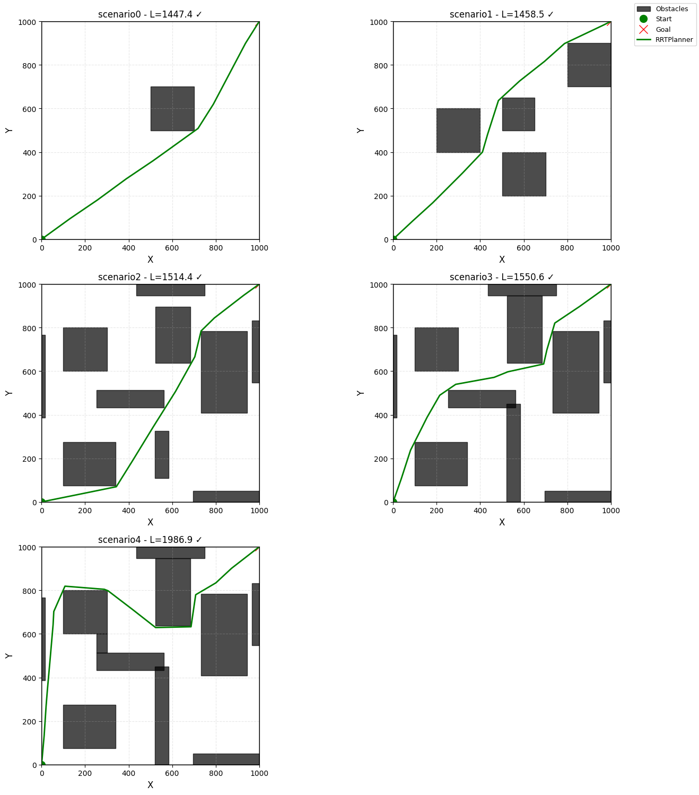
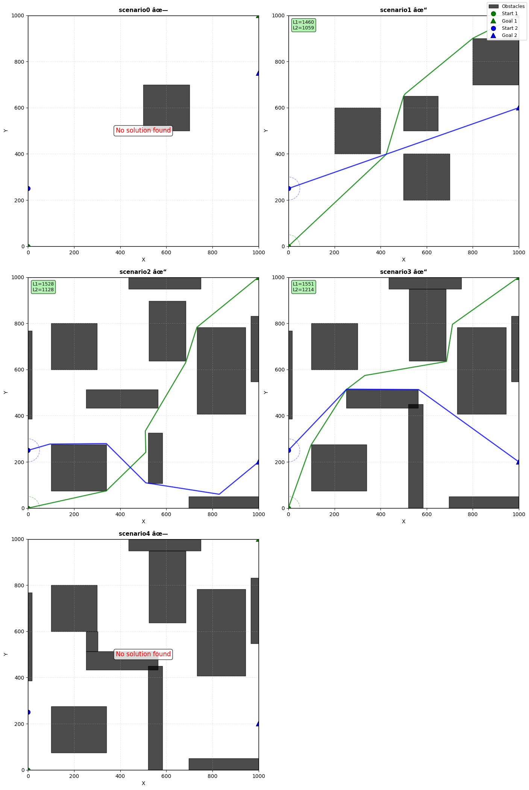

<!-- _class: lead -->

# RANDOM EXPLORER
## Path Planning in 2D Environments
### Hybrid PSO & RRT* Optimization

**Ivann KAMDEM POUOKAM & Pacifique NGANTA**
INF421 — Mars 2026

---

# I. Problématique



### Le Défi du Path Planning

Trouver un chemin **optimal** de $U_s$ à $U_d$ dans $\mathcal{X} \subset \mathbb{R}^2$, contraint par des obstacles rectangulaires $\mathcal{O}$.

### Contraintes du problème
- Espace **continu** — pas de grille discrète
- Obstacles présents
- Objectif : **zéro collision** + **longueur minimale**

### Deux familles d'approches
| Approche | Méthode | Garantie |
|---|---|---|
| Swarm | PSO | Rapide, heuristique |
| Tree | RRT* | Optimalité asymptotique |

---

# II. Détection de Collision — Liang-Barsky



$$P(t) = P_1 + t\,(P_2 - P_1), \quad t \in [0,1]$$

### Intersection axe par axe

Pour chaque axe on calcule quand le segment **entre** et **sort** de la plage de l'obstacle, puis on intersecte :

$$t_\text{enter} = \max(t_\text{x,enter},\; t_\text{y,enter},\; 0), \qquad t_\text{exit} = \min(t_\text{x,exit},\; t_\text{y,exit},\; 1)$$

> **Collision** $\iff t_\text{enter} < t_\text{exit}$ &nbsp;|&nbsp; **O(1)** par obstacle

### Chevauchement Partiel — Soft Mode

Le segment peut traverser l'obstacle **partiellement** :

```
P1 ──────────────── P2
        ┌─────────────────┐
        │    obstacle     │
        └─────────────────┘
        ↑             ↑
    t_enter       t_exit > 1 → clippé à 1
```

$$\text{overlap} = \max(0,\; t_\text{exit} - t_\text{enter}) \cdot \|P_2{-}P_1\| \;\Rightarrow\; \mathcal{C}_\text{soft} = A\!\sum_{j,k}\!\text{overlap}(j,k)$$

---

# III. PSO — Architecture & Hiérarchie



### Héritage des 5 variantes

```
PSOPathPlanner       ← vitesse, fitness vectorisée
  └── PSORestart     ← relance périodique (élites)
       └── PSOSimulatedAnnealing  ← Metropolis
            └── PSODimensionalLearning  ← DL
                 └── PSOAdaptiveInertia ← w(k)
```

### Fonction de Fitness unifiée

$$\mathcal{F}(X_i) = \underbrace{L(X_i)}_{\text{longueur}} + \underbrace{B \cdot \mathbf{1}_{\text{collision}}}_{\text{base}} +   A * \underbrace{\mathcal{C}_{\text{soft/hard}}}_{\text{segments}}$$

### Hard vs Soft Mode

| Mode | Pénalité | Gradient |
|---|---|---|
| **Hard** | $+C$ par collision détectée | Discontinu |
| **Soft** | $\text{overlap} = \max(0,\ t_{\text{exit}} - t_{\text{enter}}) \cdot \|P_2{-}P_1\|$ | **Continu** ✅ |

$$\mathcal{C}_{\text{soft}} = \sum_{j,k} \text{overlap}(j,k) \;\Longrightarrow\; \text{convergence PSO plus fluide}$$

---

# IV. PSO Core — Dynamique d'Essaim

### Équation de Vitesse Augmentée

$$V_i^{k+1} = \underbrace{w\,V_i^k}_{\text{inertie}} + \underbrace{c_1 r_1\,(P_{\text{best},i} - X_i^k)}_{\text{cognitif}} + \underbrace{c_2 r_2\,(G_{\text{best}} - X_i^k)}_{\text{social}}$$

### Paramètres retenus (Grid Search, scénarios 3 & 4)
$$S = 300,\quad N = 8 \text{ waypoints},\quad K = 100,\quad w = 0.8,\quad c_1 = 1.6,\quad c_2 = 1.0$$

### Complexité — PSO de Base

| Opération | Coût |
|---|---|
| Fitness (1 particule) — $N{+}1$ segments × $M$ obstacles | $O((N+1) \cdot M)$ |
| Fitness (essaim entier) | $O(S \cdot (N+1) \cdot M)$ |
| Mise à jour vitesses/positions | $O(S \cdot N)$ |
| **Total — $K$ itérations** | $\mathbf{O(K \cdot S \cdot N \cdot M)}$ |

---

# V. Stratégies d'Évasion

<div class="columns">
<div>

### 1. Random Restart
Réinitialise $(1{-}\rho)$ de l'essaim toutes les `rf` itérations, préserve les $\rho$ élites.
$$\text{rf} = 50,\quad \rho = 0.4$$

### 2. Simulated Annealing
Accepte $G_{\text{best}}$ dégradé avec probabilité Metropolis :
$$p = e^{-\Delta\mathcal{F}/T}, \quad T \leftarrow \beta T \quad (T_0{=}50,\; \beta{=}0.9)$$

</div>
<div>

### 3. Dimensional Learning
Si particule $i$ stagne $>$ `wait_limit` iters :
```python
for n in range(N):     # waypoints
  for d in range(2):   # x, y
    try G_best[n,d]
    keep if improves P_best[i]
```
> Surcoût : $O(2N{\cdot}(N{+}1){\cdot}M) \approx \mathbf{O(N^2 M)}$

### 4. Adaptive Inertia
$$w(k) = w_{\max} - (w_{\max}{-}w_{\min})\,\tfrac{k}{K}$$
Exploration → exploitation + **early stopping**.

</div>
</div>

---

# VI. Convergence des Variantes PSO



### Interprétation

- **Basic** : descente rapide, plateau précoce
- **Restart** : sauts périodiques, re-exploration
- **SA** : acceptation probabiliste — oscille plus
- **DL** : convergence fine, dimension par dimension
- **Adaptive** : arrêt anticipé (courbe tronquée)

### Trade-off Qualité / Temps

| Variante | Surcoût relatif |
|---|---|
| Basic | $\times 1$ |
| Restart | $\times 1.1$ |
| SA | $\times 1.5$ |
| DL | $\times 1.5 \to 2$ |
| Adaptive | $\times 0.5$ (early stop) |

---

# VII. Grid Search — Sélection des Hyperparamètres

> **225 configurations** × 2 runs × scénarios {3, 4} — Parallélisme : `ProcessPoolExecutor` (20 workers)

### Espace exploré : $S \in \{250, 300, 400\}$, $K \in \{75,100,200\}$, $w \in \{0.5, 0.7, 0.85\}$, $c_1, c_2 \in \{0.8, 1.0, 1.2, 1.4, 1.6\}$

### Top 3 configurations retenues

| Rang | Succès | Long. moy. | $S$ | $K$ | $w$ | $c_1$ | $c_2$ | Temps |
|---|---|---|---|---|---|---|---|---|
| **#1** ✅ | **100%** | **1894** | 300 | 75 | 0.70 | 1.6 | 1.0 | 5.8s |
| #2 ✅ | 100% | 2072 | 250 | 75 | 0.85 | 1.4 | 0.8 | 6.3s |
| #3 ✅ | 100% | 3715 | 300 | 75 | 0.85 | 1.6 | 1.4 | 13.4s |

### Config retenue pour tous les benchmarks
$$\boxed{S=300,\; N=8,\; K=100,\; w=0.8,\; c_1=1.6,\; c_2=1.0}$$

---

# VIII. RRT* — Exploration Optimale



### Algorithme (itération $n$, $|{\mathcal{T}}| = n$ nœuds)

1. **Sample** $x_\text{rand} \sim \mathcal{X}$ (biais goal 5 %)
2. **Nearest** $x_\text{near} = \arg\min_{v} \|v - x_\text{rand}\|$
3. **Steer** → $x_\text{new}$ à distance $\delta_s = 200$
4. **Collision** Liang-Barsky : $O(M)$
5. **Near** voisins dans rayon $\delta_r = 200$ : $O(n)$
6. **Rewire** si $\text{cost}(x_\text{near}) + d < \text{cost}(x_\text{new})$

> **Complexité par itération** : $O(n \cdot M)$
> **Total** ($n$ croît jusqu'à $K$) : $\mathbf{O(K^2 \cdot M)}$

### Paramètres retenus
$\delta_s = \delta_r = 200$, `max_iter` $= 2000$, `goal_bias` $= 5\%$

---

# IX. Optimisation de Chemin RRT*


### 3 passes de post-traitement

1. **Path shortcutting** : suppression des waypoints redondants via Liang-Barsky
2. **Intelligent Sampling** : biais vers les nœuds de l'arbre existant
3. **Smoothing** : ré-interpolation pour réduire les angles vifs

### Résultats sur 5 scénarios

| Scén. | RRT* brut | + Optim | + Int. Samp. |
|---|---|---|---|
| 0 | 1447 | **1444** | 1439 |
| 1 | 1458 | 1461 | 1473 |
| 2 | 1514 | 1524 | **1513** |
| 3 | 1551 | **1545** | **1528** |
| 4 | 1987 | 1999 | 1992 |

---

# X. Comparaison PSO vs RRT*



### Benchmark — 5 scénarios

| Scén. | PSO Long. | RRT* Long. | PSO t | RRT* t | ✓ |
|---|---|---|---|---|---|
| 0 | 1446 | 1447 | 1.6s | 13.8s | ✅ |
| 1 | 1966 | **1458** | 3.2s | 10.0s | ✅ |
| 2 | 1657 | **1514** | 6.4s | 7.6s | ✅ |
| 3 | 4101 | **1551** | 13.4s | 7.0s | ❌ |
| 4 | 2228 | **1987** | 9.6s | 4.9s | ✅ |

### Analyse

| Critère | PSO | RRT* |
|---|---|---|
| Fiabilité | 80% | **100%** |
| Temps | **Rapide avec très peu d'obstacles** | **Rapide avec une surface d'exploration faible** |
| Paramétrage | Grid Search | 4 params |
| Garantie opt. | Non | **Asymptotique** |

---

# XI. Extension Multi-Robot



### Stratégie : Planification Découplée

Chaque robot $R_i$ planifie avec RRT*, en traitant le **disque** de l'autre robot (rayon $r$) comme obstacle :

$$\mathcal{O}_{\text{eff}} = \mathcal{O} \cup \text{Disk}(R_j,\, r)$$

### Résultats Multi-Robot RRT*

| Scénario | Statut | Long. R1 | Long. R2 | Temps |
|---|---|---|---|---|
| scen.0 | ❌ Échec | — | — | — |
| scen.1 | ✅ Succès | 1477 | 1059 | 12.4s |
| scen.2 | ✅ Succès | 1511 | 1206 | 7.0s |
| scen.3 | ✅ Succès | 1535 | 1219 | 4.7s |
| scen.4 | ❌ Échec | — | — | — |

Scén. 0 & 4 : géométrie trop contrainte pour découplage.

---

<!-- _class: plain -->

# Synthèse

| | PSO | RRT* |
|---|---|---|
| **Paradigme** | Swarm Intelligence | Random Tree |
| **Fitness** | Vectorisée $O(S \cdot N \cdot M)$ | — |
| **Complexité** | $O(K \cdot S \cdot N \cdot M)$ | $O(K^2 \cdot M)$ |
| **Amélioration** | Random restart, SA, DL, Adaptive Inertia | Random restart, Intelligent simpling, smoothing |
| **Robustesse** | 4/5 scénarios | **5/5** |

### Améliorations possibles

Obstacles **dynamiques** 
&nbsp;·&nbsp; Obstacles **perméables** 
&nbsp;·&nbsp; Extension **3D** 
&nbsp;·&nbsp; Fusion PSO → RRT* *(warm start)* 
&nbsp;·&nbsp; Multi-robot **couplé**

---

<!-- _class: lead -->

# Merci de votre attention

## Questions ?

`github.com/KpihX/random-explorer`
